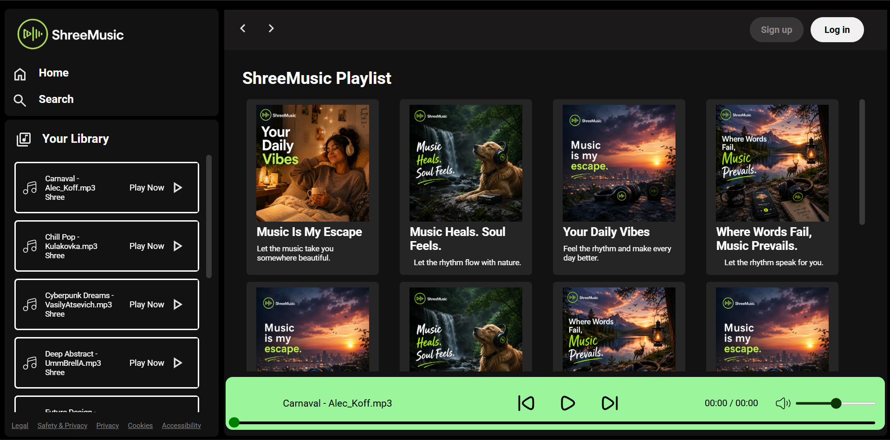

# 🎵 ShreeMusic

🎵 A responsive Spotify-inspired music player built with HTML, CSS, JavaScript, and Supabase, featuring an interactive music-player interface and a modern responsive design.

## 🚀 Features

* 🎵 Music player interface
* ▶️ Play and pause controls
* ⏭️ Song navigation
* 🎧 Music-focused UI
* 📱 Responsive design
* 🎨 Clean and modern interface

## 🛠️ Technologies Used

- HTML5
- CSS3
- JavaScript
- Supabase
- Vercel
## 📸 Preview

## 🌐 Live Demo

[🎵 Live Demo](https://shreemusic.vercel.app/)

## 📁 Project Structure

ShreeMusic/
├── css/                  # Stylesheets
├── img/                  # Images and artwork
├── js/                   # JavaScript files
├── index.html            # Main HTML page
├── favicon.ico           # Website favicon
└── README.md             # Project documentation

## ✨ Highlights

- Responsive music player interface
- Interactive JavaScript controls
- Organized frontend structure
- Music data and functionality
- Supabase integration
- Deployed with Vercel

## 📂 How to Run

1. Clone this repository.
2. Open the project folder.
3. Open `index.html` in your browser.

## 📚 What I Learned

Through this project, I practiced:

* Building layouts with HTML and CSS
* Creating interactive features with JavaScript
* Working with DOM manipulation
* Building a music-player interface
* Making a responsive web interface

## 👨‍💻 Author

**Shreedhara**

- GitHub: [@shreedhara091](https://github.com/shreedhara091)
- Live Demo: [ShreeMusic](https://shreemusic.vercel.app/)
